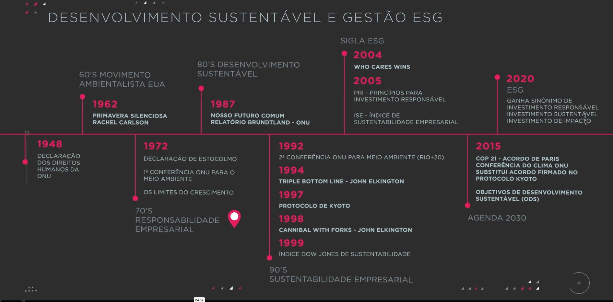
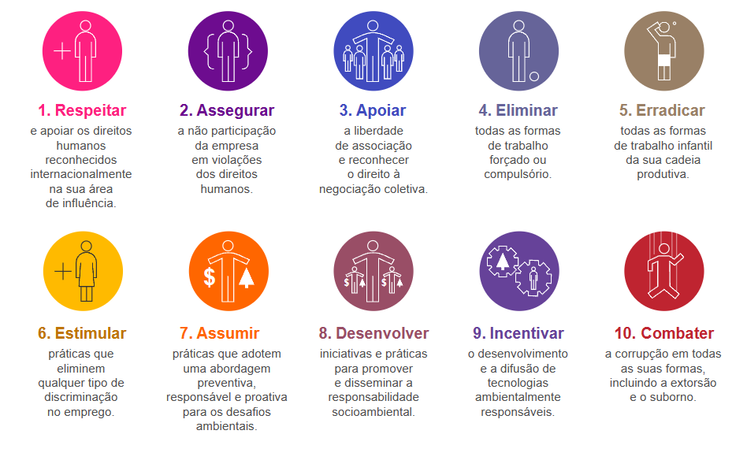
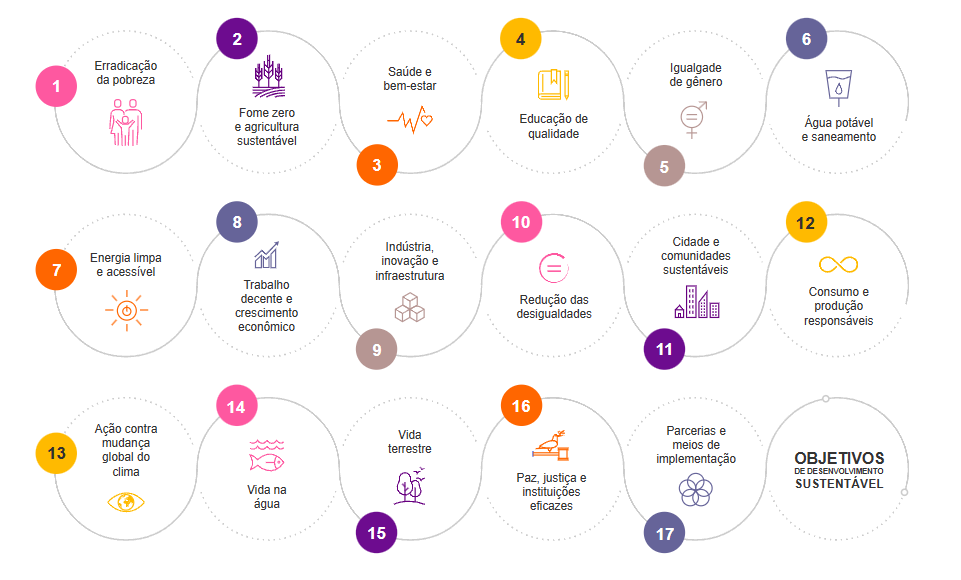

# Governança Ambiental, social e coorporativa ESG
 
 ESG é processo, não um produto. Por tanto a questão é sobre a sustentabilidade, humanidade, não apenas se o produto é de um produto reciclado.

 Para ser considerado o ESG precisa ser sustentavél, comprir os direitos humanos, ser ambientalmente consciente.

 Linha cronológica da gestão ESG:

 

 A palavra sustentável origina-se do latim sustentare, que significa sustentar, apoiar ou conservar.

 *A sustentabilidade está relacionada ao uso inteligente dos recursos naturais, afim de suprir as necessidades energéticas, sem comprometer a possibilidade de gerações futuras suprirem as suas necessidades*

<h3>Os 10x principios do Pacto da ONU criado em 2005 </h3>

1- As empresas devem apoiar e respeita a proteção dos direitos humanos reconhecidos internacionalmente.
2- As empresas devem assegura-se de sua não participação em violações desses direitos.
3- As empresas devem apoiar a liberdade de associação e o reconhecimento efetivo do direito á negociação coletiva.
4- A elimninação de todas as formas de trabalho forçado ou compulsório.
5- A abolição efeitva do trabalho infantil.
6- Eliminar a discriminação no emprego.
7- As empresas devem apoiar uma abordagem preventiva aos desafios ambientais.
8- Desenvolver iniciativas para promover maior responsabilidade ambiental.
9- Incentivar o desenvolvimento e difusção de tecnologias ambientealmente amigáveis.
10- As empresas devem combater a corrupção em todas as suas formas, inclusive extorsão e propina

<h3>os 17 Objetivos da ODS</h3>

