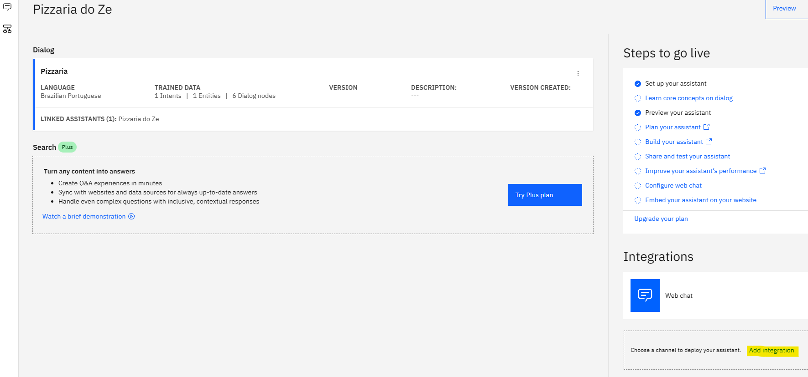
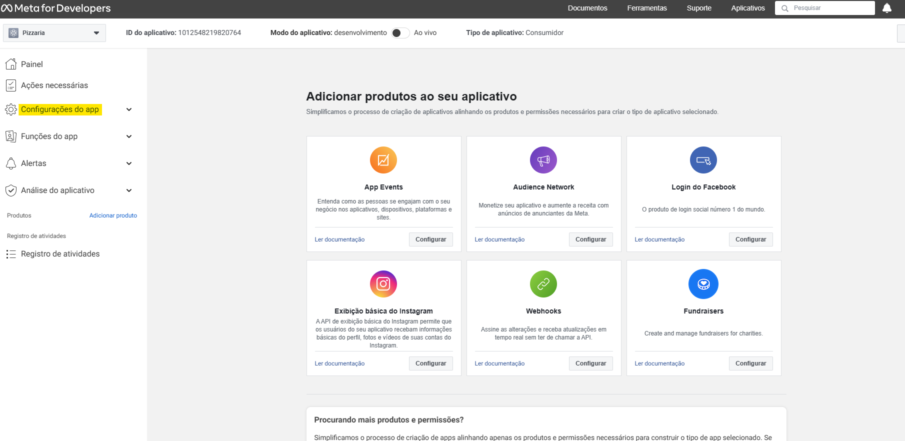

# Chatbot e Integração

A integração mais comum em plataforma de comunicação é com o Facebook Messenger
Existem inuméras plataformas para integrar com um chatbot:

- Webhook
- ChatFuel (plataforma de integração)
- Blip AI (plataforma de integração)

Usaremos o node-red e o Watson Assistent para fazer uma integração:

1- Abrimos o CMD e digitamos:<code>node-red</code>

2- Em seguida abrimos o navegador(browser) no seguinte endereço: http://127.0.0.1:1880/

3- Com isso, ira se abrir uma página da node-red

4- Pegaremos o conteúdo do link github: https://github.com/victorshinya/connect-assistant-chatfuel/blob/master/nodered.json

5- Copiaremos o conteúdo e colaremos dentro da "importar" do menu node-red

6- Abrir um sistema de nós e um campo "Watson" bugado, para arrumar, precisaremos baixar a biblioteca "node-red-node-watson"

7- Com isso o botão Watson voltará a funcionar, agora basta pegar a *API Key* do seu watson assistant (em cloud.ibm>lista de recursos>IA/Aprendizado de máquina>Watson Assistant>Api Key)

8- Também precisaremos o seu *Assistant ID* (em cloud.ibm>lista de recursos>IA/Aprendizado de máquina>Watson Assistant> Launch Watson Assistant> Clique no seu Assistant > clique nos 3 pontinhos a lado de preview> Assistant Settings)

9- Após isto clique em feito e faça a implementação, em seguida abra: http://127.0.0.1:1880/chatfuel e terá acesso a seu chatbot

<h1>Agora Usaremos o Localxpose IO</h1>

- Acessando: localxpose.io
- Não aconselhado para usar em ambiente de produção, apenas prototipação,pois não é um sistema tão seguro(podem invadir sua conta AWS e gastar milhares de dolláres sem sua permição)
- Instalação simples, basta baixar o loclx-windows-amd64, abrir como administrador e inserir:

<h1> Integração com ChatFuel</h1> 

- Acesse: https://dashboard.chatfuel.com/
- Cadastre-se ou faça seu login, apos isso acesse: https://dashboard.chatfuel.com/bots
- Clique em "adicionar um bot em braco"
- A ferramenta tem um visual bem acessivel e de fácil compreensão

<h1>Meta for Developers</h1>

- É a plataforma que utiliza o método oficial, com ferramentas para produtos como facebook, messenger, instagram, whatsapp,Oculus, Spark AR e outros produtos do grupo.
- A Vantagem desta plataforma é que os desenvolvedores não precisam de uma aplicação API
- É possivel acessar um guia rapido sobre a ferramenta no seguinte site (com conhecimento em node.js  e JavaScript): https://developers.facebook.com/docs/messenger-platform/getting-started/quick-start/

<h1>Integração direta do messenger com o Watson Assistant</h1>

- Ja existe uma integração direta no Watson Assistant
- Normalmente existe um prazo de validação(Alguns dias)
- Após a validação o usuário enxergara automáticamente

1- Para isso acesse cloud.ibm, e acesse o link "Add integration"> Selecione Facebook Messenger> Create

2- Voce precisa preenche o seu secret do meta developer
3- Voce precisa criar um app > Selecione a Opção "Outro">Selecione a opção conveniente
4- Siga os passos até chegar a esta pagina e click em Configurações de app > Básico

5 - Pegue sua chave Secreta do Aplicativo e Cole no IBM Watson
6- Voltando no site da meta, clicamos em adicionar produto>Messenger>Configurar> Em tokens de acesso > Clicamos para Adicionar ou Remover Páginas> Avançar.. até finalizar > Gerar Token, copie este token
7- Volte para o Watson e cole o token
8- No Meta em WebHooks> Clique em Adicionar URL de retorno: insira o URL e e token que o Watson forneceu apos passar o token do facebook
9- No meta , clique em Adicionar assinaturas> selecione Messages e Messaging_postbacks, clique em salvar
10- No Watson clique em next até finish
11- Após isso no site do meta, clique em "Análise do aplicativo" > Permissões e recursos, busque a permissão chamada "Messagin"> Solicitar acesso avançado

